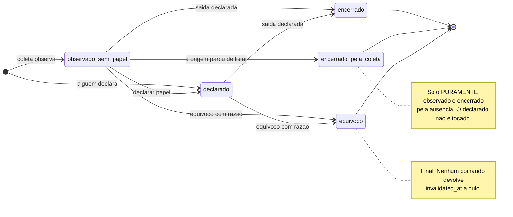
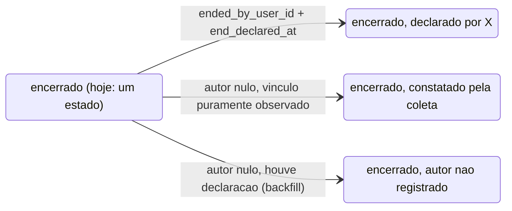

# Estados — o vínculo de pessoa a equipe (`eo.team_membership`)

<!-- DERIVADO de lib/the_band/ontology/seon/eo/schemas/team_membership.ex:52-135;
     lib/the_band/ontology/seon/eo/commands.ex:69-193, 588-769, 793-826, 1281-1345,
     1386-1441, 1453-1467;
     lib/the_band/ontology/seon/eo/queries.ex:183-242, 391-453;
     priv/repo/migrations/20260814140000_papel_declarado_tem_autor.exs:33-42,
     20260901230000_composicao_de_equipes_e_o_equivoco.exs:76-112,
     20260906230000_vinculo_observado.exs:37-46;
     docs/adr/0008-vinculo-observado.md:58-99;
     priv/knowledge_base/rules/github_team_membership_evidence.yaml:3, 77-113;
     testes: test/the_band/ontology/seon/eo/{vinculo_observado,team_membership,alocacao,
     coleta_nao_apaga_declaracao}_test.exs;
     medida do banco de desenvolvimento de 2026-09-07 (migração 20260906230000 aplicada)
     em 2026-09-07. Conferido contra o código nesta data. Regenerar ao mudar a fonte. -->

## O estado não é uma coluna

Não existe `status` em `eo_team_memberships`. A situação de um vínculo nasce da combinação de
**quatro** campos, e cada combinação é uma afirmação diferente sobre a organização.

| Estado | A regra, exatamente | Fonte |
|---|---|---|
| **observado sem papel** | `organizational_role_id` nulo **e** `declared_by_user_id` nulo **e** `ended_at` nulo **e** `invalidated_at` nulo | `commands.ex:716-731`; migração `20260906230000:15-20` |
| **declarado** | `organizational_role_id` **e** `declared_by_user_id` preenchidos, `ended_at` nulo, `invalidated_at` nulo | `commands.ex:1314-1331`; `team_membership.ex:115-122` |
| **papel sem autor** *(alcançável, sem nome na tela)* | `organizational_role_id` preenchido, `declared_by_user_id` nulo, vigente | `team_membership.ex:115-122` recusa o inverso, não este; ver *Achados* |
| **encerrado** | `ended_at` preenchido, `invalidated_at` nulo | `queries.ex:445-453` |
| **equívoco** | `invalidated_at` preenchido — com autor e razão, pelo `CHECK` | migração `20260901230000:104-112` |

**Vigente** é `ended_at` nulo **e** `invalidated_at` nulo — as duas condições, em toda consulta
(`commands.ex:176-187`). Numa data, a definição ganha as bordas: `vigente_em/2` é
`invalidated_at IS NULL AND (started_at IS NULL OR started_at <= t) AND (ended_at IS NULL OR ended_at > t)`
(`queries.ex:445-453`) — período **fechado no início e aberto no fim**, e o `started_at` nulo conta
como "sempre esteve", porque escrever só `started_at <= t` faria a pessoa deixar de ser membro
**em data alguma**, sem erro e sem aviso (`queries.ex:441-444`).

**Encerrado e equívoco não se somam.** Nenhum comando invalida um vínculo já encerrado —
`record_team_membership_mistake/5` opera sobre o vigente (`commands.ex:157-159`). Se a combinação
aparecer no banco, `vigente_em/2` a lê como **equívoco**: o invalidado nunca vigeu, em data
nenhuma, e a data de fim deixa de importar.

**A escala do estado *observado sem papel*.** Medido no banco de desenvolvimento em **2026-09-07**,
com a migração `20260906230000` aplicada: as 59 evidências viraram vínculos observados; o
antipadrão `ap02` ("equipe sem nenhum vínculo vigente") caiu de **8 equipes para 1**, e as
solicitações de autores sem vínculo caíram de **838 para 99 em 1 058**. É o estado mais populoso
desta máquina, e é o que a declaração de papel esvazia.

## A máquina

Duas coisas que **não são seta**, e por quê:

- **O retorno** — quem saiu e voltou — nasce como **linha nova** no estado *observado sem papel*;
  a antiga fica encerrada com o período preservado (`commands.ex:641-644`; ADR 0008 item 5;
  `vinculo_observado_test.exs:160`).
- **A alteração de papel** não existe como transição hoje: **não há comando**. Alterar é encerrar
  um vínculo e declarar outro, e o histórico *é* a linha encerrada
  (`specs/060-tela-da-equipe/spec.md`, tabela *Módulos*: "alteração de papel — não há comando").

## As transições, com gatilho, guarda e o teste que prova

| # | De → Para | Gatilho | Guarda | Teste |
|---|---|---|---|---|
| T1 | *(nada)* → observado sem papel | coleta: `record_team_membership_evidence/2` → `observar_vinculo/2` (`commands.ex:588,645`) | `[não há vínculo vigente do par]` (`vinculo_vigente/3`, `:706`) **e** `[não há declaração do par]` (`existe_declaracao?/3`, `:683-691`) | `vinculo_observado_test.exs:62` · `:84` (reobservar não duplica) · `:92` |
| T2 | *(nada)* → declarado | `declare_team_membership/5` (`commands.ex:69`) | `[nenhum vínculo vigente do par]` (`:72`), senão recusa dizendo desde quando (`:87-89`) | `team_membership_test.exs:169` |
| T3 | *(nada)* → declarado | `allocate/2` → `inserir_declaracao/2` (`commands.ex:1281,1314`) | índice parcial `eo_team_memberships_vigente_index` → `{:error, :already_allocated}`; `[fim ≥ início]` → `:period_inverted` | `alocacao_test.exs:47` · `:56` (dois papéis aceitos) · `:69` (mesmo papel recusado) · `:76` (períodos distintos) · `:89` (início nulo fica nulo) · `:98` (período invertido) |
| T4 | observado sem papel → declarado | `allocate/2` → `declarar_sobre_o_observado/3` (`commands.ex:1287-1312`); `promote_evidence/5` (`:1386`) | `[papel é da organização da equipe]` (`resolver_papel/3`, `:1434-1441`) · `[evidência não encerrada]` (`promovivel/2`, `:1411`) · `[papel ainda não declarado]` → `:already_promoted` (`:1422`) | `vinculo_observado_test.exs:213` (**mesmo `id`**) · `:237` (declarar de novo é recusado) · `:257` (declaração sem papel é recusada) |
| T5 | observado sem papel → encerrado pela coleta | `mark_evidence_no_longer_observed/3` (`commands.ex:793`) → `encerrar_vinculos_observados/3` (`:751`) | `[papel nulo E autor nulo]` (`:762`) — o declarado **não** é tocado; escopo por organização (`:799-802`) | `vinculo_observado_test.exs:114` (encerra, não apaga; o passado não muda) · `:138` (o declarado sobrevive) · `coleta_nao_apaga_declaracao_test.exs:74` · `:107` |
| T6 | vigente → encerrado (declarado) | `record_team_departure/5` (`commands.ex:110`) | `[data não está no futuro]` (`nao_esta_no_futuro/1`, `:125-131`) · `[existe vínculo vigente]` (`vigente/3`, `:179`) | `team_membership_test.exs:40` (SC-003: o passado não muda) · `:64` · `:81` (a linha continua, com o período fechado) |
| T7 | vigente → encerrado (por vínculo) | `end_allocation/3` (`commands.ex:1453`) | `[ainda não encerrado]` → `{:error, :already_ended}`, **sem reescrever** a data original (`:1455-1456`) · `[é deste tenant]` | `alocacao_test.exs:127` · `:144` (não reescreve) · `:159` (outro tenant) · `coleta_nao_apaga_declaracao_test.exs:136` (encerrar não apaga a evidência) |
| T8 | vigente → equívoco | `record_team_membership_mistake/5` (`commands.ex:155`) | `[razão escrita]` — guarda de função (`:156`) e `CHECK eo_equivoco_do_vinculo_completo` · `[existe vínculo vigente]` (`:157-159`) | `team_membership_test.exs:102` (não conta em período algum) · `:122` (autor e razão permanecem) · `vinculo_observado_test.exs:177` (em vínculo **observado**, e a coleta não recria) |
| T9 | encerrado → *(linha nova)* observado sem papel | reobservação da evidência: `observar_vinculo/2` (`commands.ex:645`) | `[não há vigente]` **e** `[não há declaração do par]` — se o encerrado tinha papel, autor ou invalidação, `existe_declaracao?/3` bloqueia | `vinculo_observado_test.exs:160` (saiu e voltou) · `team_membership_test.exs:193` (vincular de novo cria período novo) |
| T10 | equívoco → *(linha nova)* declarado | `declare_team_membership/5` depois do equívoco | o índice de vigência **conhece a invalidação** (`20260901230000:82-100`), então a vaga está livre — sem isso, corrigir um engano seria recusado pelo banco | `team_membership_test.exs:141` |

## O que a casa recusa — notas, não setas

- **Equívoco não volta a vigente.** Nenhum comando grava `invalidated_at: nil` (varredura de
  `lib/` em 2026-09-07). É estado final da linha; o caminho de volta é **outra linha** (T10).
- **Encerrar de novo não reescreve a data.** `{:error, :already_ended}` — a segunda tentativa é
  engano de quem opera, e sobrescrever perderia quando de fato terminou (`commands.ex:1448-1449`).
- **A coleta não cria vínculo por cima de declaração.** Onde a organização já disse algo — papel,
  autor ou equívoco —, a evidência fica sem vínculo e a tela mostra as **duas afirmações**
  (`commands.ex:648-654`; 055 FR-012; ADR 0008 item 4, `docs/adr/0008-vinculo-observado.md:72-75`).
- **A ausência na origem encerra só o observado.** O vínculo com qualquer declaração sobrevive
  (`commands.ex:745-748,762`).
- **"Continuar listando" e "voltar a listar" são fatos diferentes.** Enquanto a evidência não tem
  `no_longer_observed_at`, a observação é **contínua**; uma observação nova depois da ausência
  constatada é **retorno** (`commands.ex:617-628`; regra
  `github_team_membership_evidence.yaml:105-111`).
- **Nada é removido.** Nenhuma transição desta máquina apaga linha — SC-012 da 060, SC-005 da 055.

## Lacunas declaradas — transição sem teste

Material de trabalho do QA. Cada linha é comportamento que o código tem e nenhum teste prova.

| Comportamento | Onde | Por que importa |
|---|---|---|
| **saída com data no futuro é recusada** | `commands.ex:125-131` | é a guarda de T6 e o cenário 3 da US3 da 060; `grep -rn "futuro" test/` não acha teste de vínculo |
| **saída em vínculo já encerrado é recusada** | `commands.ex:120` devolve *"esta pessoa não tem vínculo vigente nesta equipe"* | US3 cenário 5 exige recusa **sem reescrever a data original**; `end_allocation/3` tem o teste (`alocacao_test.exs:144`), `record_team_departure/5` não |
| **equívoco sem razão é recusado** | `commands.ex:173-174` (cláusula de fallback) | US4 cenário 3; nenhum teste chama a função com razão vazia |
| **equívoco em quem não tem vínculo vigente** | `commands.ex:158-159` | recusa nomeada, sem teste |
| **`vigente/3` com dois papéis simultâneos** | `commands.ex:179-187` usa `Repo.one` | dois papéis vigentes são **permitidos** (`alocacao_test.exs:56`), e nesse estado T6 e T8 levantariam `Ecto.MultipleResultsError`. É risco declarado no `plan.md` D4 da 060, e nenhum teste o expõe |

## O que a PR 1 da feature 060 acrescenta

> **Proposto — ainda não está no código.** Fonte: `specs/060-tela-da-equipe/data-model.md` §1 e
> §3.2, `plan.md` (Summary e D4), `tasks.md` T003, T008, T014, T016, T018. Nada abaixo foi
> conferido contra código, porque ainda não existe.

### Os estados que se abrem

`ended_at` preenchido é hoje **um** estado. Com `ended_by_user_id` e `end_declared_at`
(`data-model.md` §1), vira três, e a tela precisa dizer qual é (FR-022):

| Estado proposto | A regra | O que a tela diz |
|---|---|---|
| **encerrado, declarado por alguém** | `ended_at` + `ended_by_user_id` + `end_declared_at` | *saiu em D — registrado por X em D'* |
| **encerrado, constatado pela coleta** | `ended_at` preenchido, autor nulo, e o vínculo é puramente observado | *a plataforma deixou de ver em D* — e declara que a data é limitada pela cadência da coleta (055 FR-015a) |
| **encerrado, autor não registrado** | `ended_at` preenchido, autor nulo, mas houve declaração | *author not recorded* — as saídas anteriores à migração não têm autor, e é verdade que não têm (`data-model.md` §1, Backfill) |

Dois `CHECK` novos sustentam a divisão: `eo_saida_declarada_completa` faz autor e instante andarem
juntos, e só sobre uma saída que existe; `eo_declaracao_tem_autor` faz o mesmo com
`declared_by_user_id` e `declared_at` (`data-model.md` §1). **`ended_at` continua sendo a data da
saída, e `end_declared_at` o instante do registro** — colapsá-las faria "saiu em março, declarado
em setembro" virar "saiu em setembro", que é o que SC-001 proíbe.

### As transições que mudam

| # | Transição | O que muda | Fonte |
|---|---|---|---|
| P1 | T6 (vigente → encerrado) | `record_team_departure/5` passa a **usar** o `actor_id` que hoje ignora (`commands.ex:110`, `_actor_id`), grava `ended_by_user_id` e `end_declared_at`, e opera sobre **todos** os vínculos vigentes do par por `update_all` — não sobre `Repo.one` | `plan.md` D4; `tasks.md` T014 |
| P2 | T8 (vigente → equívoco) | mesmo tratamento: `update_all` sobre todos os vigentes do par; zero vigentes vira erro nomeado | `plan.md` D4; `tasks.md` T016 |
| P3 | **encerrado → *(nada)*** | a guarda da recriação passa a reconhecer a **saída declarada**: `existe_declaracao?/3` ganha `ended_by_user_id`. Hoje um vínculo observado com saída declarada tem papel e autor nulos e invalidação nula → `existe_declaracao?` devolve `false` → **a coleta recria** | `plan.md` (Summary); `data-model.md` §3.2 (regra v3); `tasks.md` T003, T014 |
| P4 | T9 (retorno) | passa a ser explícito: `observar_vinculo` recebe `retorno?`, e só nasce vínculo novo depois de a ausência ter sido **constatada** (`no_longer_observed_at`) | `tasks.md` T014; spec 060 FR-026, FR-027 |
| P5 | **declarado → declarado (outro papel)** | ganha comando: `change_role/5` = `end_allocation/4` + `declare_role/6` numa transação, devolvendo `{:ok, %{encerrado, novo}}` | spec 060 Impacto; `plan.md` (premissa *Alterar papel*); `tasks.md` T018 |
| P6 | toda transição de escrita | passa a exigir `pode_gerir_estrutura/3` **no evento**, não só na renderização: esconder o botão não é autorização | spec 060 FR-006; `tasks.md` T012 |

## Achados

1. **A guarda da recriação não vê a saída declarada.** `existe_declaracao?/3`
   (`commands.ex:683-691`) reconhece declaração por `declared_by_user_id`,
   `organizational_role_id` **ou** `invalidated_at`. Um vínculo **observado** cuja saída foi
   declarada tem os três nulos — e a coleta seguinte recria o vínculo, desfazendo em silêncio o
   que alguém declarou. O comentário do código (`:678-682`) descreve o equívoco corretamente; a
   saída não está lá. É o defeito que a FR-026 da 060 fecha. **A quem levar**: já está na PR 1
   (T003, T014).

2. **A ADR 0008 e a regra v2 dizem menos do que a decisão de 2026-09-07 exige.** ADR 0008 item 4
   (`docs/adr/0008-vinculo-observado.md:72-75`) fala em "vínculo **declarado** — vigente, encerrado
   ou invalidado"; o vínculo **observado** com saída declarada não cabe nessa frase. A regra
   `github_team_membership_evidence.yaml` está em `version: 2` (`:3`) e a nota da promoção
   (`:89-93`) não menciona bloqueio por saída. **A quem levar**: a ADR ganha nota em T025; a regra
   vira v3 em T003.

3. **`Repo.one` em `vigente/3` é incompatível com FR-018.** Dois papéis simultâneos são aceitos
   por desenho (`commands.ex:1263-1266`; `alocacao_test.exs:56`) e recusados por acidente na saída
   e no equívoco, que levantariam exceção. Nenhum teste cobre o caso. **A quem levar**: QA (teste
   que expõe) e a PR 1 (D4 corrige).

4. **`[NEEDS CLARIFICATION]` — o estado *papel sem autor*.** `EO.allocate/2` grava
   `organizational_role_id` sem `declared_by_user_id` quando o chamador não passa o autor; o
   changeset recusa o inverso, não este (`team_membership.ex:115-122`). Acontece hoje em
   `test/the_band_web/live/equipe_composta_test.exs:70-78`. A leitura de origem do roster é
   `declared_by_user_id` nulo ou preenchido (`data-model.md` §4.1), então esse vínculo apareceria
   como **observado com papel declarado**. Pergunta: é estado legítimo, e a tela ganha um quarto
   rótulo, ou é chamada incompleta a fechar no changeset? **A quem**: Software Architect e
   Product Owner.

5. **`[NEEDS CLARIFICATION]` — encerrado *e* invalidado.** O banco aceita a combinação; nenhum
   comando a produz; `vigente_em/2` a lê como equívoco. A tela deve apresentar *equívoco* (a
   leitura da consulta) ou *saiu, e depois foi marcado como engano* (a leitura das colunas)?
   FR-011 da 060 dá texto para os dois separadamente e não para o encontro dos dois.
   **A quem**: Product Owner, com o Design.
