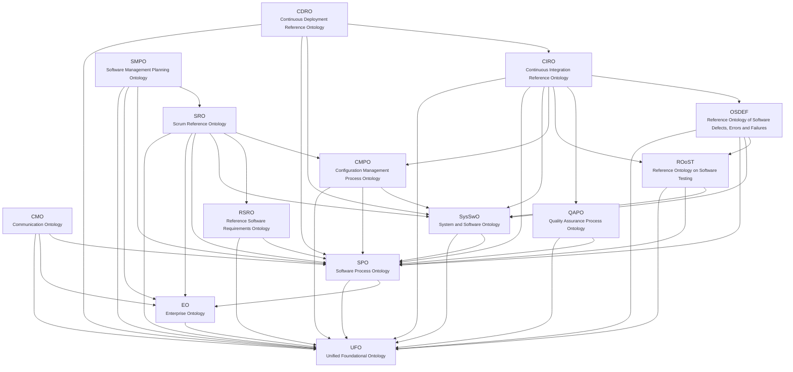

<!-- GERADO POR scripts/generate_docs.py (--lang en) A PARTIR DE priv/knowledge_base/. NÃO EDITE À MÃO: o texto inglês de um conceito se escreve na base, no campo `en`. -->

# Ontology network

!!! note "Generated from the knowledge base"
    Every text on this page comes from the English fields of `priv/knowledge_base/`.

Documentation generated from `priv/knowledge_base/`. The YAML base is the source of truth; this page is derived from it.

**14 ontologies · 240 concepts · 177 relations · 77 competency questions**

## Architecture

Each arrow means *reuses concepts from*. The direction always goes from the more specific module to the more general one; the reverse path is forbidden and checked by `scripts/validate_knowledge_base.py`.

## Ontologies

| Ontology | Layer | Network | Depends on | Concepts | Relations | CQs |
|---|---|---|---|---:|---:|---:|
| [UFO](ufo.md) — Unified Foundational Ontology | Foundational | UFO | — | 12 | 3 | 0 |
| [EO](eo.md) — Enterprise Ontology | Core | SEON | `ufo` | 12 | 11 | 5 |
| [SPO](spo.md) — Software Process Ontology | Core | SEON | `ufo`, `eo` | 24 | 16 | 0 |
| [SysSwO](sys_swo.md) — System and Software Ontology | Core | SEON | `ufo`, `spo` | 11 | 6 | 0 |
| [CDRO](cdro.md) — Continuous Deployment Reference Ontology | Domain | Continuum | `ufo`, `spo`, `sys_swo`, `ciro` | 17 | 10 | 13 |
| [CIRO](ciro.md) — Continuous Integration Reference Ontology | Domain | Continuum | `ufo`, `spo`, `sys_swo`, `cmpo`, `roost`, `qapo`, `osdef` | 50 | 30 | 14 |
| [CMO](cmo.md) — Communication Ontology | Domain | Continuum | `ufo`, `eo`, `spo` | 4 | 8 | 4 |
| [CMPO](cmpo.md) — Configuration Management Process Ontology | Domain | SEON | `ufo`, `spo`, `sys_swo` | 27 | 21 | 0 |
| [OSDEF](osdef.md) — Reference Ontology of Software Defects, Errors and Failures | Domain | SEON | `ufo`, `spo`, `sys_swo`, `roost` | 6 | 5 | 0 |
| [QAPO](qapo.md) — Quality Assurance Process Ontology | Domain | SEON | `ufo`, `spo` | 12 | 10 | 0 |
| [ROoST](roost.md) — Reference Ontology on Software Testing | Domain | SEON | `ufo`, `spo`, `sys_swo` | 14 | 6 | 0 |
| [RSRO](rsro.md) — Reference Software Requirements Ontology | Domain | SEON | `ufo`, `spo` | 5 | 2 | 0 |
| [SMPO](smpo.md) — Software Management Planning Ontology | Domain | Continuum | `ufo`, `eo`, `spo`, `sro` | 3 | 3 | 4 |
| [SRO](sro.md) — Scrum Reference Ontology | Domain | Continuum | `ufo`, `eo`, `spo`, `sys_swo`, `rsro`, `cmpo` | 43 | 46 | 37 |

## Distinctions the model preserves

| Do not confuse | Why |
|---|---|
| Pull Request ≠ Merge | a PR is a change request (`cmpo.change_request`); a merge is a distinct event |
| Person ≠ Team member | `eo.team_member` is a role; `eo.team_membership` is the contextual relation |
| Intended process ≠ performed process | SPO separates `intended_*` from `performed_*` |
| Code ≠ Program | code constitutes the program without being identical to it |
| Requirement document ≠ Requirement | the artifact describes the requirement, it is not the requirement |
| Test case ≠ Test execution | ROoST separates planning from execution |
| Code smell ≠ Defect | a noncompliance (QAPO) is not a defect (OSDEF) |
| Defect ≠ Fault ≠ Failure | a failure is an event; a defect is a disposition; a fault is the manifested defect |

## Origin

Paulo Sérgio dos Santos Júnior. *From Continuous Software Engineering Reference Ontologies to the Integration of Data for Data-Driven Software Development*. Universidade Federal do Espírito Santo (UFES), 2023.

