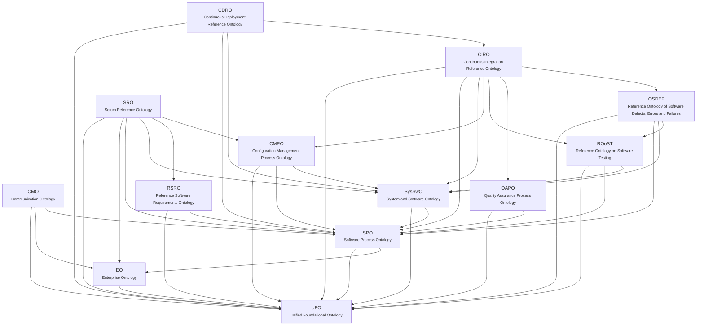

<!-- GERADO POR scripts/generate_docs.py A PARTIR DE priv/knowledge_base/. NÃO EDITE À MÃO. -->

# Rede de ontologias

Documentação gerada a partir de `priv/knowledge_base/`. A base YAML é a fonte da verdade; esta página é derivada dela.

**13 ontologias · 230 conceitos · 167 relações · 73 perguntas de competência**

## Arquitetura

Cada seta significa *reusa conceitos de*. A direção vai sempre do módulo mais específico para o mais geral; o caminho inverso é proibido e verificado por `scripts/validate_knowledge_base.py`.

## Ontologias

| Ontologia | Camada | Rede | Depende de | Conceitos | Relações | CQs |
|---|---|---|---|---:|---:|---:|
| [UFO](ufo.md) — Unified Foundational Ontology | Fundacional | UFO | — | 12 | 3 | 0 |
| [EO](eo.md) — Enterprise Ontology | Core | SEON | `ufo` | 10 | 8 | 5 |
| [SPO](spo.md) — Software Process Ontology | Core | SEON | `ufo`, `eo` | 23 | 13 | 0 |
| [SysSwO](sys_swo.md) — System and Software Ontology | Core | SEON | `ufo`, `spo` | 11 | 6 | 0 |
| [CDRO](cdro.md) — Continuous Deployment Reference Ontology | Domínio | Continuum | `ufo`, `spo`, `sys_swo`, `ciro` | 17 | 10 | 13 |
| [CIRO](ciro.md) — Continuous Integration Reference Ontology | Domínio | Continuum | `ufo`, `spo`, `sys_swo`, `cmpo`, `roost`, `qapo`, `osdef` | 50 | 30 | 14 |
| [CMO](cmo.md) — Communication Ontology | Domínio | Continuum | `ufo`, `eo`, `spo` | 4 | 8 | 4 |
| [CMPO](cmpo.md) — Configuration Management Process Ontology | Domínio | SEON | `ufo`, `spo`, `sys_swo` | 27 | 21 | 0 |
| [OSDEF](osdef.md) — Reference Ontology of Software Defects, Errors and Failures | Domínio | SEON | `ufo`, `spo`, `sys_swo`, `roost` | 6 | 5 | 0 |
| [QAPO](qapo.md) — Quality Assurance Process Ontology | Domínio | SEON | `ufo`, `spo` | 8 | 9 | 0 |
| [ROoST](roost.md) — Reference Ontology on Software Testing | Domínio | SEON | `ufo`, `spo`, `sys_swo` | 14 | 6 | 0 |
| [RSRO](rsro.md) — Reference Software Requirements Ontology | Domínio | SEON | `ufo`, `spo` | 5 | 2 | 0 |
| [SRO](sro.md) — Scrum Reference Ontology | Domínio | Continuum | `ufo`, `eo`, `spo`, `sys_swo`, `rsro`, `cmpo` | 43 | 46 | 37 |

## Distinções que o modelo preserva

| Não confunda | Por quê |
|---|---|
| Pull Request ≠ Merge | PR é solicitação de mudança (`cmpo.change_request`); merge é evento distinto |
| Pessoa ≠ Membro de equipe | `eo.team_member` é papel; `eo.team_membership` é a relação contextual |
| Processo planejado ≠ executado | SPO separa `intended_*` de `performed_*` |
| Código ≠ Programa | código constitui o programa sem ser idêntico a ele |
| Documento de requisito ≠ Requisito | o artefato descreve o requisito, não é o requisito |
| Caso de teste ≠ Execução de teste | ROoST separa planejamento de execução |
| Code smell ≠ Defeito | não conformidade (QAPO) não é defeito (OSDEF) |
| Defect ≠ Fault ≠ Failure | failure é evento; defect é disposição; fault é o defeito manifestado |

## Origem

Paulo Sérgio dos Santos Júnior. *From Continuous Software Engineering Reference Ontologies to the Integration of Data for Data-Driven Software Development*. Universidade Federal do Espírito Santo (UFES), 2023.

