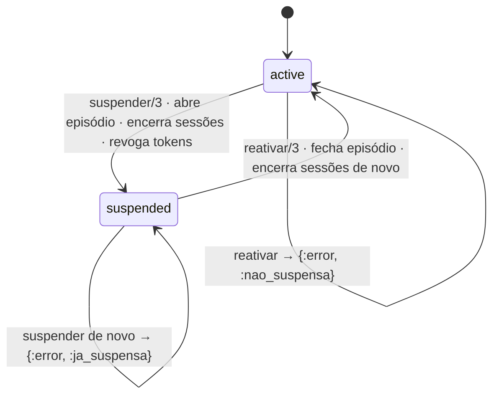

# Data model — 070, o operador da plataforma

As decisões e as alternativas estão em [research.md](research.md). Aqui ficam as tabelas, as
constraints e as transições.

> **Emendado em 2026-10-01** pela avaliação da segunda autenticação
> ([seguranca-autenticacao.md](seguranca-autenticacao.md) §4, item 7): A11 (`last_seen_at`), A13a
> (`BEFORE TRUNCATE`), A13b (`IS DISTINCT FROM` por coluna), A13c (`email_at_grant`); e pelo
> **segundo fator TOTP** (FR-016): colunas em §1 e a tabela §1a. As colunas do TOTP são desenho
> sujeito à avaliação de segurança própria do TOTP (`tasks.md`).

**Estas tabelas não são de domínio.** Não têm `internal_id` nem `record_version`, como
`user_sessions` e `api_access_tokens` também não têm: não são registro ontológico, são
infraestrutura de acesso. E **quatro** delas **não têm `tenant_id`** — `platform_operators`,
`platform_operator_grants`, `platform_operator_sessions` e `platform_operator_recovery_codes` (§1 a
§3 e §1a) —, porque o operador não pertence a organização nenhuma (FR-011). A quarta nasceu com o
segundo fator (FR-016), e a contagem antiga, "três", era de antes dela; o desvio de `AGENTS.md`
§7.3 em `plan.md` declara as quatro. `tenant_suspensions` (§4) tem `tenant_id`. Isso é a exceção que a spec decidiu, e ela fica confinada ao módulo
`TheBand.Platform`: nenhuma função de domínio recebe estas structs.

---

## 1. `platform_operators` — o operador

| coluna | tipo | regra |
|---|---|---|
| `id` | uuid, PK | `gen_random_uuid()` |
| `email` | string, not null | índice único sobre `lower(email)` |
| `name` | string, not null | |
| `password_hash` | string, null | **nulo até a definição**; `redact: true` no schema |
| `password_epoch` | integer, not null, default 0 | sobe atômico a cada definição, como `user.ex:221-233` |
| `setup_code_hash` | bytea, null | `sha256` do código de definição; `redact: true` |
| `setup_code_expires_at` | utc_datetime, null | |
| `failed_attempts` | integer, not null, default 0 | espera crescente (research R2) |
| `last_failed_at` | utc_datetime, null | |
| `logged_in_at` | utc_datetime, null | |
| `totp_secret` | binary cifrado (`TheBand.Encrypted.Binary`, Cloak, como as credenciais das ferramentas), null | segredo de 20 bytes; nulo até o primeiro passo da definição; `redact: true`; **`load_in_query: false`** no schema (seguranca-totp.md, T4): o Cloak decifra no carregamento, e sem isso todo `%Operator{}` lido por `OperatorScope`, `Sessions.conferir/2` ou `Grants` traria o segredo em claro na memória da requisição. Só `Credentials` o lê, por `select` explícito **dentro** da transação com `FOR UPDATE`, e o embrulha em `Segredo.novo/1` na mesma expressão |
| `totp_confirmed_at` | utc_datetime, null | nulo até o **terceiro** passo (`concluir_cadastro/2`, a única que o grava); **com nulo, `autenticar/3` recusa**, inclusive por código de recuperação |
| `totp_last_used_step` | bigint, null | o último passo TOTP aceito; contra reuso do mesmo código |
| `second_factor_failures` | integer, not null, default 0 | falhas consecutivas do segundo fator **com a senha certa**; em 10, o segundo fator trava até o reinício (seguranca-totp.md, T1). Zerado no sucesso, em `definir_senha/3`, `conceder/3` e `reiniciar_credencial/2` |
| `enrollment_code_hash` | bytea, null | `sha256` do código de cadastro do segundo fator; `redact: true` |
| `enrollment_code_expires_at` | utc_datetime, null | 10 minutos |
| `ack_code_hash` | bytea, null | `sha256` do **código de guarda** dos códigos de recuperação, emitido por `confirmar_segundo_fator/3` e consumido por `concluir_cadastro/2` (emenda T012, Q3 (b)); `redact: true`. Coluna própria, e não a do código de cadastro: com a mesma, o código do passo 2 abriria o passo 3 |
| `ack_code_expires_at` | utc_datetime, null | 10 minutos |
| `inserted_at`, `updated_at` | utc_datetime | |

Constraints:

- `CHECK ((setup_code_hash IS NULL) = (setup_code_expires_at IS NULL))`;
- `CHECK ((enrollment_code_hash IS NULL) = (enrollment_code_expires_at IS NULL))`;
- `CHECK (totp_confirmed_at IS NULL OR totp_secret IS NOT NULL)`: não há segundo fator confirmado
  sem segredo;
- `CHECK (totp_confirmed_at IS NULL OR password_hash IS NOT NULL)`;
- `CHECK (second_factor_failures >= 0)`;
- `CHECK ((ack_code_hash IS NULL) = (ack_code_expires_at IS NULL))`: o par do código de guarda,
  como os outros dois códigos;
- `CHECK (ack_code_hash IS NULL OR (totp_confirmed_at IS NULL AND totp_secret IS NOT NULL AND
  totp_last_used_step IS NOT NULL AND enrollment_code_hash IS NULL))`: o código de guarda só existe
  **entre os passos 2 e 3** do cadastro — o TOTP já foi conferido uma vez contra o segredo pendente
  (`totp_last_used_step` gravado), o código de cadastro já foi anulado, e o segundo fator ainda não
  vale (`totp_confirmed_at` nulo). Um código de guarda com `totp_confirmed_at` preenchido seria um
  passo 3 repetível depois do cadastro concluído; com `enrollment_code_hash` preenchido, dois
  passos abertos ao mesmo tempo.

  **`second_factor_failures` fica fora deste `CHECK`, de propósito.** Nesse estado ele está em 0 na
  prática — `definir_senha/3` o zerou, `confirmar_segundo_fator/3` e `concluir_cadastro/2` contam
  falha só em `failed_attempts`, e `autenticar/3` recusa com `totp_confirmed_at` nulo **antes** de
  conferir o segundo fator, sem subir o contador —, mas amarrá-lo ao código de guarda no banco
  transformaria uma mudança futura nessa contagem em erro de restrição no meio do cadastro, e não
  protegeria nada: o contador só tem efeito sobre um segundo fator confirmado (T1);
- índice único `platform_operators_email_index` sobre `lower(email)`.

O e-mail **pode** coincidir com o de uma conta em `users`: são entradas diferentes, por formulários
diferentes, e nenhum resolvedor lê as duas tabelas. A reutilização de senha entre as duas não é
detectável sem ler um hash com a senha do outro, e fica como risco residual.

## 1a. `platform_operator_recovery_codes` — os códigos de recuperação do segundo fator

| coluna | tipo | regra |
|---|---|---|
| `id` | uuid, PK | |
| `operator_id` | uuid, FK `platform_operators`, `on_delete: :restrict`, not null | |
| `code_hash` | bytea, not null | `sha256` do código normalizado; `redact: true` |
| `used_at` | utc_datetime, null | preenchido **só no uso** por `autenticar/3` (seguranca-totp.md, T8) |
| `invalidated_at` | utc_datetime, null | preenchido quando o código deixa de valer **sem ter sido usado**: nova definição de senha (`definir_senha/3`), reinício e nova concessão (A6). Separado de `used_at` para que "algum código de recuperação foi usado por alguém?" se responda pelo banco, e não só pelo log, que tem retenção de log (T8) |
| `inserted_at` | utc_datetime | |

Constraints e índices:

- índice único `(operator_id, code_hash)`;
- `CHECK (used_at IS NULL OR invalidated_at IS NULL)`: um código foi usado **ou** invalidado,
  nunca os dois. A invalidação só marca os que estão com as duas colunas nulas, e o uso só consome
  os que estão com as duas nulas; o registro do uso não é sobrescrito pela invalidação seguinte (T8);
- índice parcial `operator_id WHERE used_at IS NULL AND invalidated_at IS NULL`, para contar os que
  restam;
- o consumo é um `UPDATE … WHERE used_at IS NULL AND invalidated_at IS NULL … RETURNING`,
  conferindo uma linha (`contracts/segundo-fator-do-operador.md`).

Os códigos não se apagam um a um: `used_at` ou `invalidated_at` os tiram de uso, e a linha fica
como registro. **Retenção (seguranca-totp.md, T8; T058)**: `ApagaSessoesAntigas` apaga as linhas
com `coalesce(used_at, invalidated_at) < now() - interval '90 days'`, e **nunca** as vigentes (as
duas colunas nulas), por mais antigas que sejam.

## 2. `platform_operator_grants` — a concessão, relator e não booleano

| coluna | tipo | regra |
|---|---|---|
| `id` | uuid, PK | |
| `operator_id` | uuid, FK `platform_operators`, `on_delete: :restrict`, not null | |
| `granted_at` | utc_datetime, not null | |
| `granted_via` | string, not null | `CHECK (granted_via = 'release_command')` |
| `granted_by_declared` | text, not null | **declarado** por quem rodou o comando, e não autenticado (O11) |
| `email_at_grant` | string, not null | o e-mail do operador **no momento** da concessão (A13c): `platform_operators.email` é mutável, e o histórico precisa dizer **quem** recebeu o papel |
| `revoked_at` | utc_datetime, null | |
| `revoked_via` | string, null | `CHECK (revoked_via IS NULL OR revoked_via = 'release_command')` |
| `revoked_by_declared` | text, null | |
| `revoke_note` | text, null | |
| `inserted_at` | utc_datetime | sem `updated_at`: a única alteração é a revogação, que tem a própria data |

Constraints:

- índice único parcial `platform_operator_grants_vigente_index` sobre `operator_id`
  `WHERE revoked_at IS NULL`: uma concessão vigente por operador, na forma de
  `access_scope_grants` (`20260828160856_access_scope_grants.exs:39`);
- `CHECK ((revoked_at IS NULL) = (revoked_via IS NULL) AND (revoked_at IS NULL) = (revoked_by_declared IS NULL))`;
- trigger `platform_operator_grants_nao_apaga`, `BEFORE DELETE`, que levanta;
- trigger `platform_operator_grants_so_revoga`, `BEFORE UPDATE`, que levanta salvo quando
  `OLD.revoked_at IS NULL` e só `revoked_at`, `revoked_via`, `revoked_by_declared` e `revoke_note`
  mudam. A comparação é **coluna a coluna**, com `NEW.<coluna> IS DISTINCT FROM OLD.<coluna>` para
  cada coluna fora da revogação (`id`, `operator_id`, `granted_at`, `granted_via`,
  `granted_by_declared`, `email_at_grant`, `inserted_at`), que é seguro com nulo (A13b);
- trigger `platform_operator_grants_nao_trunca`, `BEFORE TRUNCATE … FOR EACH STATEMENT`, que
  levanta: `TRUNCATE` não dispara trigger de linha (A13a).

**O nome `granted_by_declared` é a afirmação**: a prova de quem executou é o acesso ao Dokploy,
que fica fora da aplicação. O nome impede que alguém leia a coluna como autor autenticado.

## 3. `platform_operator_sessions` — a sessão do operador

| coluna | tipo | regra |
|---|---|---|
| `id` | uuid, PK | é o que vai no cookie, junto com o bruto |
| `operator_id` | uuid, FK `platform_operators`, `on_delete: :restrict`, not null | |
| `token_hash` | bytea, not null | índice único |
| `password_epoch` | integer, not null | época da leitura que conferiu a senha |
| `ended_at` | utc_datetime, null | |
| `last_seen_at` | utc_datetime, not null | gravado na abertura e, no máximo uma vez por minuto, a cada conferência aceita; mais de **30 min** sem uso derruba a sessão (A11) |
| `inserted_at` | utc_datetime | validade de **8 h** a contar daqui |

Índices: `operator_id`, `ended_at`, `inserted_at` (para a retenção).

Retenção: apagada 90 dias depois de deixar de valer, pelo `ApagaSessoesAntigas`. É o **único**
caminho que apaga, como em `sessions.ex:154-176` de `development` (`apagar_as_que_deixaram_de_valer/1`).

## 4. `tenant_suspensions` — o episódio

| coluna | tipo | regra |
|---|---|---|
| `id` | uuid, PK | |
| `tenant_id` | uuid, FK `tenants`, `on_delete: :restrict`, not null | |
| `suspended_at` | utc_datetime, not null | |
| `suspended_by_operator_id` | uuid, FK `platform_operators`, `on_delete: :restrict`, null | nulo **só** em `not_recorded` |
| `suspend_reason` | string, not null | lista fechada (§5) |
| `suspend_note` | text, null | obrigatória nas razões que a base diz |
| `reactivated_at` | utc_datetime, null | |
| `reactivated_by_operator_id` | uuid, FK `platform_operators`, `on_delete: :restrict`, null | |
| `reactivate_reason` | string, null | lista fechada (§5) |
| `reactivate_note` | text, null | |
| `inserted_at`, `updated_at` | utc_datetime | |

Constraints:

- índice único parcial `tenant_suspensions_aberto_index` sobre `tenant_id`
  `WHERE reactivated_at IS NULL` — **um episódio aberto por organização** (O9, SC-002);
- índice `(tenant_id, suspended_at)` para o histórico;
- `CHECK ((suspend_reason = 'not_recorded') = (suspended_by_operator_id IS NULL))`;
- `CHECK` de tudo-ou-nada da reativação: `reactivated_at`, `reactivated_by_operator_id` e
  `reactivate_reason` são os três nulos ou os três preenchidos;
- triggers `tenant_suspensions_nao_apaga`, `tenant_suspensions_so_fecha` e
  `tenant_suspensions_nao_trunca`, na forma dos de §2. O `so_fecha` compara com `IS DISTINCT FROM`
  cada coluna da abertura (`tenant_id`, `suspended_at`, `suspended_by_operator_id`,
  `suspend_reason`, `suspend_note`, `inserted_at`), aceita preencher os quatro campos da
  reativação só a partir de nulos, e **libera `updated_at`** (A13b).

**`tenants.status` continua sendo a resposta rápida, e o episódio é o registro.** As duas escritas
estão na mesma transação, e desde §4a o banco recusa o `COMMIT` em que elas discordam.

## 4a. O invariante "estado só com episódio", no banco

Achado **D1-a** de `seguranca-autenticacao.md` ("Conferência das emendas D1"), **decidido pela pessoa
mantenedora em 2026-10-01**. O `xref` guarda `trocar_estado_no_multi/5`, e não o invariante: uma
escrita de `status` por `change/2`, `force_change/3`, `update_all` noutro módulo ou `eval` de release
deixaria a organização `suspended` sem episódio, ou `active` com um aberto. O que guarda o invariante
é um trigger de constraint **adiado**, que vale para todo caminho que passa pelo banco.

Migração própria, `priv/repo/migrations/<ts>_estado_tem_episodio.exs` (tarefa T044a), **depois** da
de §4 (T044), que cria `tenant_suspensions` e insere os episódios `not_recorded`:

```sql
CREATE FUNCTION tenant_estado_tem_episodio() RETURNS trigger AS $$
DECLARE
  alvo uuid;
  estado text;
  aberto boolean;
BEGIN
  -- O ramo por IF, e não um CASE no DECLARE: o PL/pgSQL resolve os dois campos do CASE contra
  -- o registro NEW, e em `tenants` não há `tenant_id` — toda escrita em `tenants`, inclusive
  -- create_tenant/1 e o bootstrap, falhava com `record "new" has no field "tenant_id"`
  -- (medido no postgres:16 do projeto, achado E1 da terceira reanálise). Com IF, só o campo do
  -- ramo tomado é lido.
  IF TG_TABLE_NAME = 'tenants' THEN
    alvo := NEW.id;
  ELSE
    alvo := NEW.tenant_id;
  END IF;

  SELECT status INTO estado FROM tenants WHERE id = alvo;
  IF NOT FOUND THEN RETURN NULL; END IF;
  aberto := EXISTS (SELECT 1 FROM tenant_suspensions
                    WHERE tenant_id = alvo AND reactivated_at IS NULL);
  IF (estado = 'suspended') IS DISTINCT FROM aberto THEN
    RAISE EXCEPTION 'organização % com estado % e episódio aberto = %', alvo, estado, aberto
      USING ERRCODE = 'check_violation', CONSTRAINT = 'tenant_estado_tem_episodio';
  END IF;
  RETURN NULL;
END $$ LANGUAGE plpgsql;

CREATE CONSTRAINT TRIGGER tenants_estado_tem_episodio
  AFTER INSERT OR UPDATE OF status ON tenants
  DEFERRABLE INITIALLY DEFERRED FOR EACH ROW EXECUTE FUNCTION tenant_estado_tem_episodio();

CREATE CONSTRAINT TRIGGER tenant_suspensions_estado_tem_episodio
  AFTER INSERT OR UPDATE OF reactivated_at ON tenant_suspensions
  DEFERRABLE INITIALLY DEFERRED FOR EACH ROW EXECUTE FUNCTION tenant_estado_tem_episodio();
```

- **adiado** (`INITIALLY DEFERRED`) porque, em research R8, o passo `:estado` vem **antes** do
  `:episodio`: no meio da transação legítima o estado e o episódio discordam, e só o `COMMIT` é o
  ponto em que os dois têm de concordar. A função relê as duas tabelas **no `COMMIT`**, e não usa
  o `NEW` além do id, então vê o estado final da transação;
- dispara nas duas tabelas: em `tenants`, a escrita de estado sem episódio; em `tenant_suspensions`,
  o episódio aberto ou fechado sem a troca de estado. `DELETE` de episódio já é recusado por
  `tenant_suspensions_nao_apaga` (§4), e `DELETE` de organização com episódio, pela FK `restrict`;
- `INSERT` em `tenants` entra: criar a organização já `suspended` sem episódio é recusado, e
  `create_tenant/1` e `bootstrap.ex:155`, que criam `active`, passam;
- **a ordem com a migração de dados**: um trigger de constraint só confere linhas **escritas depois
  dele**, e não valida o que já está na tabela. Por isso a migração de T044 insere os `not_recorded`
  primeiro, e o `up` desta, **antes** de criar o trigger, roda a consulta de §7 e a recíproca e
  **levanta** com as contagens se alguma não der zero (a mesma regra de research R6: nunca mapear em
  silêncio). O `down` apaga os dois triggers e a função;
- **no sandbox de teste ele não aparece sozinho**: o `Ecto.Adapters.SQL.Sandbox` nunca faz `COMMIT`,
  então o trigger adiado nunca dispara. O teste que o observa força a conferência com
  `SET CONSTRAINTS tenants_estado_tem_episodio, tenant_suspensions_estado_tem_episodio IMMEDIATE`
  dentro da transação. É também por isso que os testes de `Tenants` que suspendem por `update_all`
  sem episódio (T013) continuam verdes: não confirmam nada. Fora do sandbox, a mesma escrita é
  recusada;
- é o **primeiro trigger de constraint adiado** do repositório; os anteriores (`nao_apaga`,
  `so_revoga`, `so_fecha`, `nao_trunca`, §2 e §4) são imediatos.

**De que lado fica, e o princípio X, letra D.** A função lê `tenants` (só `id` e `status`) e
`tenant_suspensions`, e os triggers ficam nas duas: nenhum lado o escreve sem tocar a tabela do outro.
É a **primeira** das duas exceções declaradas à letra D, e só no banco (a segunda é a FK de §6, `api_access_tokens`; `plan.md`, Constitution Check). Fica do lado da **`Platform`**, numa migração
dela (T044a), porque:

1. o invariante é do episódio (O10, SC-002, a consulta de §7), que é conceito da `Platform`;
2. a direção permitida é `Platform → Tenants`. Do lado de `Tenants`, a migração faria `Tenants`
   depender de uma tabela da `Platform`, a direção inversa, e `Tenants` passaria a ter de saber o que
   é um episódio;
3. nenhum código Elixir de nenhum dos dois lados ganha dependência: `Tenants` continua sem ler
   `tenant_suspensions`, e `Platform` continua sem ler nem escrever `tenants` em Elixir. A função lê
   de `tenants` só o que a `Platform` já recebe por `resumos_para_a_plataforma/0`.

O que fica pior: a regra fica invisível a quem lê Elixir, e quem altera `tenants.status` noutro
desenho precisa saber que o banco recusa — o nome do erro (`tenant_estado_tem_episodio`) diz onde
olhar.

### Transições



## 5. As razões, na base de conhecimento

Arquivo novo: `priv/knowledge_base/rules/platform_tenant_suspension.yaml`, `derivation_rule:` com
id `platform.tenant_suspension`, `provenance.source_type: project_decision`. Forma de
`access_account_lifecycle.yaml`.

**A lista é proposta**, e quem a confirma é a revisão semântica e a pessoa mantenedora, no PR do
YAML:

| bloco | código | rótulo (tela, inglês) | nota |
|---|---|---|---|
| suspend · offered | `suspected_compromise` | Suspected compromise | obrigatória |
| suspend · offered | `contract_ended` | The contract ended | opcional |
| suspend · offered | `requested_by_the_organisation` | Requested by the organisation | opcional |
| suspend · offered | `other` | Other | obrigatória |
| suspend · recorded_only | `not_recorded` | The reason was not recorded | só a migração escreve |
| reactivate · offered | `investigation_closed_no_compromise` | Investigation closed — no compromise found | `offered_only_against: suspected_compromise` |
| reactivate · offered | `contract_resumed` | The contract resumed | opcional |
| reactivate · offered | `suspended_by_mistake` | Suspended by mistake | opcional |
| reactivate · offered | `other` | Other | obrigatória |

## 6. Alterações em tabelas existentes

### `tenants`

- `CHECK (status IN ('active', 'suspended'))`, nome `tenants_status_valido`;
- o `up` conta os valores fora da lista e **levanta** se houver algum (research R6);
- o episódio `not_recorded` para cada organização `suspended` sem episódio aberto é inserido pela
  migração de §4 (T044), que cria a tabela, e não por esta (T013), que roda antes de a tabela existir;
- **quem escreve `status` depois disso é só `Tenants.trocar_estado_no_multi/5`**, um passo que entra
  no `Ecto.Multi` de `Platform.Suspensions`; e quem lê a tabela para a área do operador é só
  `Tenants.resumos_para_a_plataforma/0` e `resumo_para_a_plataforma/1`, com as quatro colunas
  (`contracts/sessoes-e-tokens-da-organizacao.md`). `Platform` não toca a tabela (constituição,
  princípio X, letra D; achado D1). Qualquer outra escrita que deixe o estado sem o episódio
  correspondente é recusada no `COMMIT` pelo trigger de §4a (D1-a).

### `api_access_tokens`

**Na migração de `Tenants`**, `priv/repo/migrations/<ts>_revogacao_por_suspensao.exs` (tarefa T047),
posterior à de §4, e **não** na do episódio (T044): a tabela é de `Tenants`, e `Platform` não altera
tabela alheia (achado L1; `plan.md`, Constitution Check, princípio X, letra D). A FK para
`tenant_suspensions` é a **segunda** exceção declarada à letra D, só no banco (`plan.md`, Constitution
Check): aponta de `Tenants` para a `Platform`, e é integridade referencial, e não leitura: `Tenants` recebe o id do episódio por
argumento em `revogar_por_suspensao/2`.

- coluna `revoked_by_suspension_id`, uuid, FK `tenant_suspensions`, `on_delete: :restrict`, null;
- `CHECK (revoked_by_suspension_id IS NULL OR revocation_clause = 'organizacao_suspensa')`;
- `CHECK (revocation_clause IS DISTINCT FROM 'organizacao_suspensa' OR revoked_by_suspension_id IS NOT NULL)`.

Os dois juntos dizem: a cláusula `organizacao_suspensa` existe **se e só se** há um episódio
apontado. As linhas antigas (cláusula nula, suspensão nula) passam pelos dois.

Na regra `api.access` (`api_access_thresholds.yaml:91-105`) entra a chave
`clausulas_so_registradas: [organizacao_suspensa]`, com rótulo
`{ pt-BR: "organização suspensa", en: "organisation suspended" }`.
`ApiTokens.clausulas_de_revogacao/0` continua devolvendo **só as oferecidas**, e a tela de tokens
não muda de select.

### `user_sessions`

**Nenhuma alteração** (FR-011). O encerramento por organização usa o índice que já existe
(`20260929100000_sessoes_de_usuario.exs:54`).

### `users`

**Nenhuma alteração** (FR-011). É o que torna a #879 independente desta feature (research R11).

## 7. A consulta do SC-002

```sql
SELECT count(*) FROM tenants t
WHERE t.status = 'suspended'
  AND NOT EXISTS (SELECT 1 FROM tenant_suspensions s
                  WHERE s.tenant_id = t.id AND s.reactivated_at IS NULL);
-- MUST devolver 0
```

E a recíproca, que a transação também garante: nenhuma organização `active` com episódio aberto.
