# Data model — spec 071, os papéis do banco

**Nenhuma tabela nova, nenhuma coluna nova, nenhuma migração.** O modelo desta feature são os
papéis do PostgreSQL e os privilégios entre eles. Os privilégios são aplicados a cada deploy por
`TheBand.Papeis.conceder/2` (research R2), e não por migração.

## Os papéis

| papel | atributos | posse | usado por |
|---|---|---|---|
| `the_band_owner` (o que migra; estado-alvo, S11) | `LOGIN`, `NOSUPERUSER`, `NOCREATEROLE`, `NOCREATEDB` | **todo** objeto da base da aplicação, depois do `REASSIGN OWNED` do roteiro | o entrypoint, só para migrar e conceder; o `rollback/2` |
| `the_band_app` (o que serve) | `LOGIN`, `NOSUPERUSER`, `NOCREATEROLE`, `NOCREATEDB`, `NOREPLICATION`, `NOBYPASSRLS` | **nada** | o processo que serve: requisições, jobs, `rpc`, `eval` dos comandos de release |
| `postgres` | superusuário | nada, depois do `REASSIGN OWNED` | administração e backup; nunca a aplicação |

Os nomes são do roteiro. O código não os escreve: o papel que serve é o usuário do `DATABASE_URL`,
e o que migra é o usuário do `DATABASE_MIGRATION_URL`.

## Os privilégios de quem serve (FR-002), a lista fechada

| objeto | privilégio |
|---|---|
| a base | `CONNECT` (e `TEMP`, que `PUBLIC` já tem; S10) |
| o esquema `public` | `USAGE` |
| toda tabela, menos `schema_migrations` | `SELECT, INSERT, UPDATE, DELETE` |
| `schema_migrations` | `SELECT` |
| toda sequência | `USAGE, SELECT` |

**Negados por construção**: `TRUNCATE`, `REFERENCES`, `TRIGGER`, `CREATE` no esquema ou na base,
`SET` em `session_replication_role`, `MAINTAIN` (PostgreSQL 17) e `ALL`.

**Os privilégios padrão**: `ALTER DEFAULT PRIVILEGES FOR ROLE <o que migra> IN SCHEMA public GRANT
SELECT, INSERT, UPDATE, DELETE ON TABLES TO <o que serve>`, e o mesmo para `USAGE, SELECT ON
SEQUENCES`. Tabela criada por outro papel não os recebe, e falha alto na primeira escrita.

## O relator (R3)

```text
{veredito, motivos}
veredito ∈ :em_vigor | :nao_em_vigor | :inconclusivo
motivos  ⊆ :superusuario | :atributo_perigoso | :dono_de_objeto | :membro_do_dono
          | :membro_predefinido | :privilegio_a_mais | :schema_migrations_gravavel
          | :replica_permitida | :create_no_esquema | :mesma_credencial
          | :credencial_que_migra_ausente | :tentativa_passou | :tentativa_inconclusiva
          | :funcao_sem_search_path | :dono_superusuario
```

`:em_vigor` só com a lista de motivos **vazia**, ou só com `:dono_superusuario`, que é aviso sobre
quem migra. Qualquer tentativa que não deu `42501` impede o `:em_vigor`.

## Os estados do deploy (FR-008, R4)

```mermaid
stateDiagram-v2
    [*] --> com_credencial: DATABASE_MIGRATION_URL presente
    [*] --> sem_credencial: ausente
    com_credencial --> migra_e_concede: migrate() como o que migra
    migra_e_concede --> serve: unset; exec
    sem_credencial --> migra_como_hoje: quem serve é dono de schema_migrations
    sem_credencial --> sobe_sem_migrar: não é dono, nenhuma pendente
    sem_credencial --> nao_sobe: não é dono, há pendente
    migra_como_hoje --> serve: relator nao_em_vigor
    sobe_sem_migrar --> serve: relator lido
    nao_sobe --> [*]: set -e, linha nomeia a variável
```


